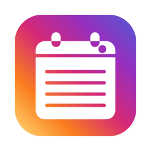
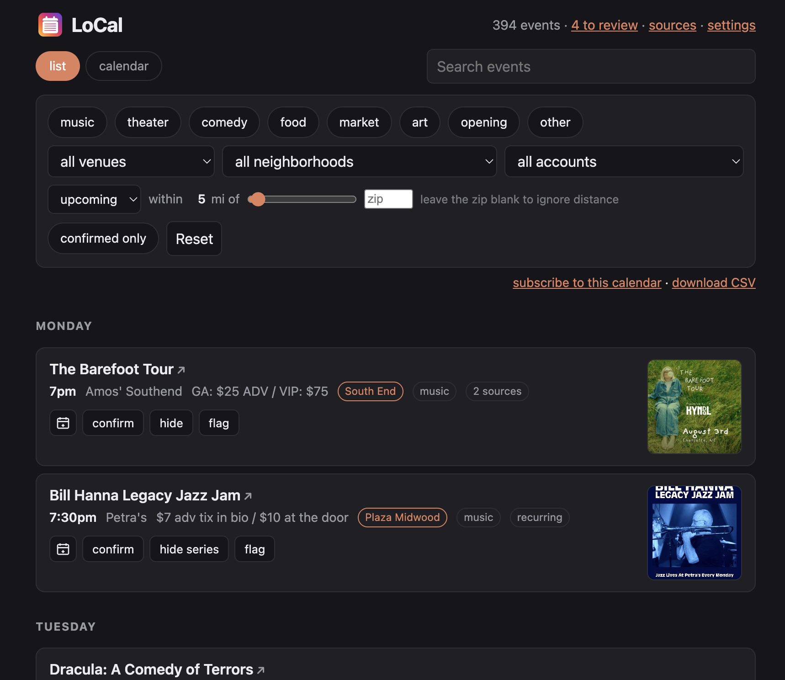
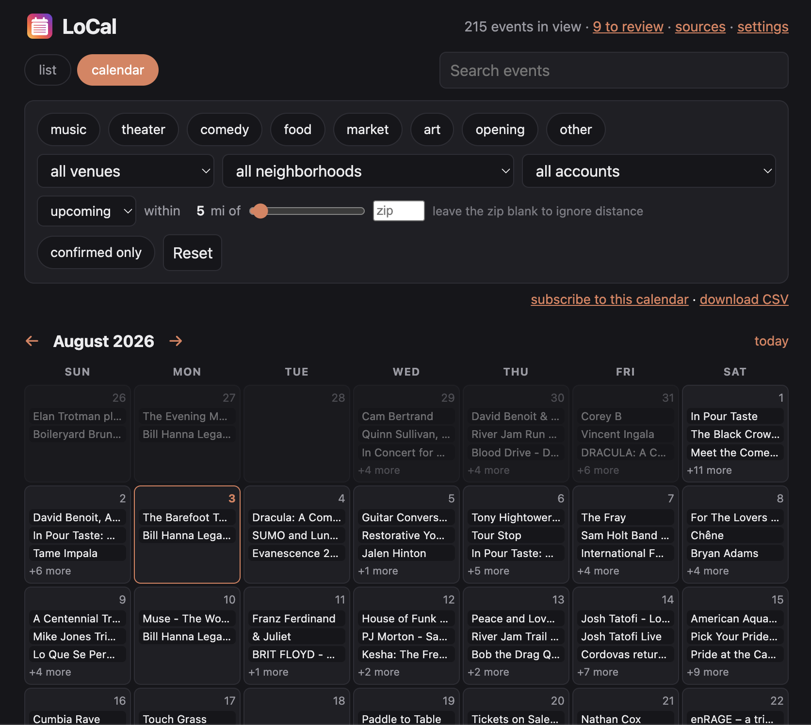
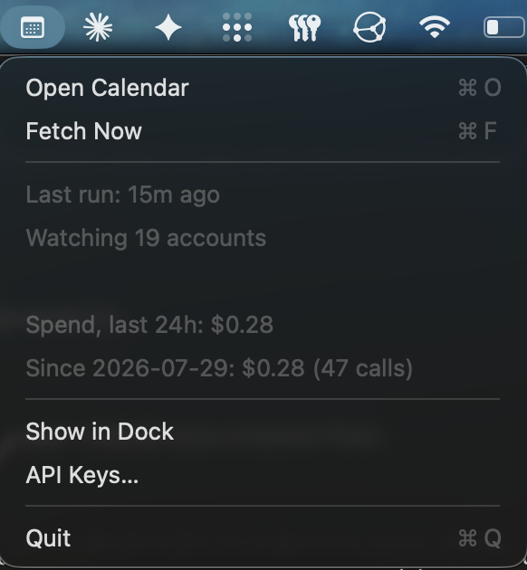

<div align="center">



# LoCal

**Cure your FOMO**

LoCal tracks upcoming events from your favorite artists and venues

### [Download LoCal for Mac](https://github.com/colinarndt/instagram-calendar/releases/latest)

<sub>Apple Silicon · no account · your data stays on your Mac</sub>

</div>

<br>

<div align="center">

</div>

<details>
<summary>Prefer a month grid?</summary>

<br>

<div align="center">

</div>
</details>

<br>

## Your sources, one calendar

**Instagram accounts**<br>
Follow the venues, organizers, and local businesses that announce events in
their posts. LoCal reads the caption and, when it finds an event, the flyer too.

**Venue calendars**<br>
Add an events page or an `.ics` calendar feed. LoCal imports iCalendar,
schema.org event data, and several common event-list layouts directly. Other
layouts can use a small text-only AI pass after LoCal removes images, scripts,
and raw markup.

**Performer tour pages**<br>
Follow a musician, comedian, speaker, or other act. LoCal adds dates within the
distance you choose and can alert you when it finds a new nearby show.

When several sources describe the same event, LoCal keeps one calendar entry and
retains the links back to each source.

## Features

**Find the right night.**<br>
Filter by category, date, venue, neighborhood, source, and distance. Search by
title or caption, then switch between a list and month grid.

**Keep your shortlist.**<br>
Mark events as interested, hide the ones you have ruled out, or flag anything
that needs a second look.

**Handle recurring events once.**<br>
LoCal flags likely recurring venue listings for review. Approve a series once,
then manage its current and future dates together.

**Refresh on your schedule.**<br>
Instagram accounts, venue pages, and performer pages each keep their own
refresh interval. The Mac app checks for due sources while it runs and catches
up after your Mac wakes.

**Put it on your phone.**<br>
Subscribe to any filtered view through an `.ics` feed. Keep music from one
neighborhood in your phone calendar while you browse everything else on your
Mac.

**See the cost before it happens.**<br>
LoCal shows an estimate before a paid Instagram refresh and records the amount
it actually spent on model calls and scraping.

**Keep your data local.**<br>
LoCal has no account, server, or telemetry. Your sources, event data, and API
keys stay on your Mac.

## How it works

Add the local sources you already trust. Website calendars with structured event
data go straight into LoCal. Instagram posts go through a small caption check so
LoCal can skip ordinary updates; it only reads the flyer when a post looks like
an event. For a venue page without useful structured data, LoCal can send its
sanitized visible text to a small model and validates event links against the
page before importing them.

LoCal then groups duplicate listings, finds venue locations, drops wrong-metro
matches, and turns patterns such as “every Thursday” into dates on your
calendar.

## Install on a Mac

**1. [Download the `.dmg`](https://github.com/colinarndt/instagram-calendar/releases/latest)** and drag LoCal to Applications.

**2. Open LoCal.**

The app is signed but not notarized. macOS will block the first launch. Open
**System Settings → Privacy & Security**, scroll down, and choose the option to
open it anyway. You only need to do this once.

On macOS 15 and later, right-clicking the app no longer offers the old bypass.
If you prefer Terminal, run:

```bash
xattr -dr com.apple.quarantine "/Applications/LoCal.app"
```

**3. Add API keys.**

LoCal uses [OpenAI](https://platform.openai.com/api-keys) to read event flyers
and unsupported venue pages, and [Apify](https://console.apify.com/settings/integrations)
to fetch public Instagram posts. Structured website calendars do not require
either service.

**4. Add sources.**

Open **Sources** and paste Instagram profiles, venue event pages, `.ics` feeds,
or performer tour pages. LoCal does not fetch anything until you add it.

## Cost

Instagram polling uses Apify for fetching and OpenAI for caption and flyer
extraction. Venue calendars with usable structured data are free to import. An
unsupported venue page uses an OpenAI text pass only when the page changes, and
LoCal caches that result.

| Instagram accounts | Rough monthly cost |
|---|---:|
| 10 | **$1.30** |
| 25 | **$3.25** |
| 50 | **$6.50** |

Those estimates come from measured usage. Busy accounts cost more than quiet
ones because the number of posts matters more than the number of accounts.

The menu bar shows the last 24 hours and the recorded total since LoCal started
tracking spend. Each amount comes from the token counts and provider charges
reported for your own requests.



## Use it from a checkout or server

Requires Python 3.11 or later.

```bash
git clone https://github.com/colinarndt/instagram-calendar
cd instagram-calendar
python3 -m venv .venv && source .venv/bin/activate
pip install -e .

local-calendar init
```

`init` asks for your city, radius, timezone, API keys, and interests. The city
and radius keep events focused on your area.

```bash
local-calendar-web        # http://localhost:8730
local-calendar run-once   # fetch and extract; may cost money
local-calendar geocode    # fill in missing venue coordinates
local-calendar stats      # show event and spend totals
```

Approve accounts at `/discover` before LoCal polls them. Add websites and
performer watches on the same page.

To schedule a headless install yourself:

```cron
0 7 * * * /path/to/.venv/bin/local-calendar run-once --yes >> /tmp/local.log 2>&1
```

`--yes` confirms that a scheduled run may spend money. On a laptop, use
`launchd` instead of cron so a sleeping Mac catches up after it wakes. Do not run
your own scheduler alongside the Mac app.

LoCal keeps its data in `~/Library/Application Support/instagram-calendar` on
macOS (`$XDG_DATA_HOME` on Linux and `%APPDATA%` on Windows). Set
`SOCIAL_CALENDAR_HOME` to choose another location. LoCal keeps the original
folder name so an Instagram Calendar update opens your existing calendar and
keys without a data migration.

## Build the Mac app

```bash
pip install pyinstaller
./make_dmg.sh              # -> dist/LoCal.dmg
```

The build script draws the icon, bundles Python with the app, and creates the
drag-to-Applications disk image. To run the steps separately:

```bash
python make_icon.py         # -> AppIcon.icns
pyinstaller --noconfirm LoCal.spec
./make_dmg.sh --no-build
```

The app uses an ad-hoc signature rather than Apple notarization. Verify a built
image after packaging changes:

```bash
codesign --verify --deep --strict --verbose=2 "/Volumes/LoCal/LoCal.app"
```

## Privacy and security

LoCal runs as a single-user app. It has no login and no hosted account.

Do not expose the web interface to the public internet. It listens on your local
network so you can reach it from your phone, which means anyone on that network
could access it.

The web interface never accepts API keys. Set them through the Mac app or
`local-calendar init`; LoCal stores them in a mode-600 `.env` file in its data
directory. Nothing leaves your machine except the provider calls needed to fetch
and read the sources you choose.

## What this repository excludes

The repository does not include the database, cached flyers, profile pictures,
or scraped source content. Those materials belong to third parties. They remain
on your machine and stay out of published releases.

## License

No license yet. Ask before reusing the code.
