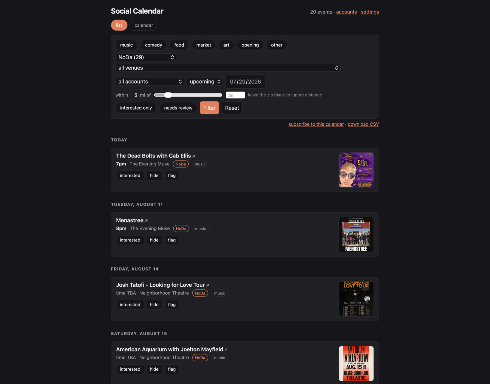
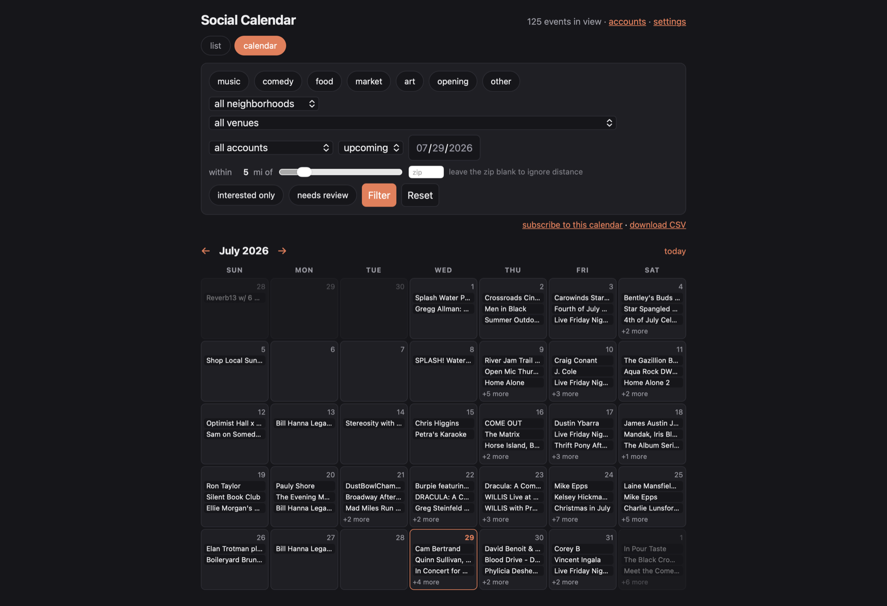

<div align="center">


# InstaCalendar

**Sometimes the best local events only get announced on Instagram.**

InstaCalendar reads those posts for you and drops everything onto a nice clean event calendar.

### [⬇︎ Download for Mac](https://github.com/colinarndt/instagram-calendar/releases/latest)

<sub>Apple Silicon · no account, no signup · your data stays on your Mac</sub>

</div>

<br>



<details>
<summary>Prefer a month grid?</summary>

<br>



</details>

<br>

## Features

- 🎛️ **Filterssss.** Zero in by event type, venue, neighborhood, IG account, upcoming dates, or distance.
- ✅ **Confirm the good ones.** Come back later and pull up your shortlist.
- 🌐 **Follow venue calendars too.** Add an events page or calendar feed even when it has no Instagram account.
- 🌞 **Wake up to fresh events.** The app checks every source once a day, even with its window closed.
- 📱 **Take it to your phone.** Subscribe to any filtered calendar from the app.
- 🏠 **Keep it on your Mac.** Your calendar stays on your computer. No account, server, or telemetry.
- 🫵 **You get the last word.** Confirm, hide, or flag any event. AI still needs an editor.
- 💸 **Know what it costs.** The menu bar shows a running total from real usage, and the app quotes each paid action before it starts.

## How it works

You pick the Instagram accounts and website calendars worth watching. Once a day
the app checks every source (as long as it's running in your menu bar).

Website events published as iCalendar, schema.org structured data, or a supported
server-rendered event listing go straight into the calendar without an AI call.
For other layouts, the app sends sanitized visible text—not images, scripts, or
raw markup—to the nano model, validates its links against the page, and caches
the result until the page changes.
When a later Instagram caption clearly identifies one of those events, the post
is attached as another source and its flyer does not need to be processed again.

Most posts are not events. A cheap first pass reads each caption and throws those out. 
Actual event posts get passed to a model that **reads the flyer image**, where the date, 
the set times and the lineup usually live. 

Then it dedupes events across Instagram and websites. It looks up
where the venue actually is and drops anything not in your city. It even works out
which nights "every Thursday" covers.

What you get is a calendar you can filter by category, neighborhood, venue or
distance, plus an `.ics` feed you can subscribe to in your phone's calendar app.

## Install

**1. [Download the `.dmg`](https://github.com/colinarndt/instagram-calendar/releases/latest)** and drag the app to Applications.

**2. Open it. macOS will refuse the first time.**

You will get a dialog saying the app cannot be verified. This is expected. The
app is signed, but Apple charges $99/year to have that signature blessed, and
this is a free tool with no company behind it.

To get past it, go to **System Settings → Privacy & Security**, scroll down, and
click the button offering to open it anyway. That is the whole fix, and you only
do it once. (On macOS 15 and later, right-click → Open no longer works. Apple
moved it.)

Or run this in Terminal:

```bash
xattr -dr com.apple.quarantine "/Applications/Instagram Calendar.app"
```

**3. Paste in two API keys** when it asks. It needs
[OpenAI](https://platform.openai.com/api-keys) to read the flyers and
[Apify](https://console.apify.com/settings/integrations) to fetch the posts. Both
take about a minute to sign up for.

**4. Pick some sources.** Click **sources** in the top right, then paste in
Instagram profile URLs, approve suggestions, or add venue event pages and `.ics`
feeds. Nothing gets fetched until you say so.

That's it. A small calendar icon sits in your menu bar, the app runs itself once
a day, and you can open the calendar whenever you want.

## What it costs

Two APIs charge per use: Apify to fetch Instagram posts, and OpenAI to read
captions, flyers, or an otherwise unsupported events page. Instagram cost follows
how many accounts you watch; a website fallback runs only when its page changes.

Structured website calendars do not use either API. A page without usable
structured data can use a small `gpt-5.4-nano` text call; that usage appears in
the same spend total as Instagram extraction and is cached while the page stays
unchanged.

| Accounts you follow | Roughly per month |
|---|---|
| 10 | **$1.30** |
| 25 | **$3.25** |
| 50 | **$6.50** |

About **13¢ per account per month** — roughly 6¢ of model calls and 7¢ of
scraping. Follow ten busy accounts and you will pay more than for ten quiet
ones; the number that matters is posts, not handles.

The model half is measured rather than estimated: both stages were replayed over
real posts from a working database and priced from the token counts the API
returned. Reading the flyer is the expensive call and runs on `gpt-5.4-mini`; the
caption filter in front of it is a yes/no question that `gpt-5.4-nano` answers
for about a quarter as much. How often venues post — a little over once a day each,
across 8 real accounts — comes from [SPEC.md §8](SPEC.md).

Adding a few more accounts costs pennies. The real limit is how many you can be
bothered to curate.

### You can always see what you have spent

Nothing runs up a bill quietly. Open the menu bar icon and the running total is
right there: the last 24 hours, and everything since you installed it.


Those figures come from your actual usage. Every model call is priced from the
token counts on the response, and every fetch from the dollars the finished run
reports, so this is counted rather than estimated.

Start with a handful of accounts while you get a feel for it.

## Living with it

**It updates itself.** The app asks how long it has been since anything was
checked, and runs when that passes 24 hours. Shut your laptop at 3am and it
catches up when you open it, which is the part cron gets wrong.

**Subscribe on your phone.** The `.ics` feed respects whatever filters you have
set, so you can subscribe to just music in one neighborhood and still browse
everything on your Mac.

**Impatient?** Every account has a **fetch it now** button that polls just that
one, every website has its own refresh button, and there is a refresh-all for the
whole rotation. Paid Instagram actions show their estimated cost first; structured
website fetches are direct and free, while unsupported layouts can use the cached
nano text fallback described above.

**Interested, hide, flag.** Every event has three buttons. The model is good, not
perfect, and you are the last word on what stays.

<br>

---

<details>
<summary><b>Running it without the Mac app</b> (Linux, a server, or from a checkout)</summary>

<br>

Requires Python 3.11+.

```bash
git clone https://github.com/colinarndt/instagram-calendar
cd instagram-calendar
python3 -m venv .venv && source .venv/bin/activate
pip install -e .

social-calendar init
```

`init` asks for your city, a radius in miles, your timezone, your two API keys,
and optionally what you are into (it will suggest starter accounts). The city
goes into the extraction prompts so the model knows whose venues it is reading.
The radius drops venues that geocode to the wrong metro, because Nominatim will
resolve a Charlotte query to Port Charlotte, Florida without blinking.

Then:

```bash
social-calendar-web        # http://localhost:8730
social-calendar run-once   # scrape + extract. COSTS MONEY.
social-calendar geocode    # fill in venue coordinates
social-calendar stats      # what's in the database, and what it has cost
```

Approve accounts at `/discover` first. Nothing is polled until you do.

To schedule it yourself:

```cron
0 7 * * * /path/to/.venv/bin/social-calendar run-once --yes >> /tmp/run.log 2>&1
```

`--yes` is required. A scheduled run has no terminal to answer the confirmation
prompt, so `run-once` refuses rather than hanging. It spends money, so saying so
moves into the crontab. On a laptop prefer `launchd` over cron, for the same
lid-shut reason the app's own scheduler exists. If you use the Mac app, skip this
entirely: two schedulers would race for the same accounts.

Runs are incremental. Each account records when it was last polled, and a run
fetches what is newer than that plus a two-day overlap. A missed run is not a gap
you have to repair.

Everything the app writes lives in
`~/Library/Application Support/instagram-calendar` (`$XDG_DATA_HOME` on Linux,
`%APPDATA%` on Windows). Set `SOCIAL_CALENDAR_HOME` to move it. Coming from a
version that kept `data/` beside the code, run `social-calendar migrate`, which
copies and leaves the originals alone.

</details>

<details>
<summary><b>Building the app yourself</b></summary>

<br>

```bash
pip install pyinstaller
./make_dmg.sh              # -> dist/Instagram Calendar.dmg (~27MB)
```

That draws the icon, builds the bundle, and wraps it in the drag-to-Applications
image. To do the steps separately:

```bash
python make_icon.py                             # -> AppIcon.icns
pyinstaller --noconfirm InstagramCalendar.spec  # -> dist/Instagram Calendar.app
./make_dmg.sh --no-build                        # wrap an existing .app
```

`make_icon.py` draws the icon with CoreGraphics and compiles the `.icns` rather
than checking in a binary nobody can edit. pyobjc is already a dependency, every
size renders from the same geometry at its native pixel count instead of getting
downsampled from one master, and changing the artwork means editing constants at
the top of the file.

The app is about 44MB and carries its own Python, so it runs with the repo and
the virtualenv deleted. It stays that size because the cached flyers (200MB and
growing) live in Application Support rather than inside the bundle. A build that
comes out near 250MB means that separation broke.

The build is ad-hoc signed, not notarized. The signature survives inside the
image, which is what separates "Gatekeeper wants a click" from the "app is
damaged" dead end. Worth re-checking after any change to how the image gets
staged, since copying a signed bundle is what breaks signatures:

```bash
codesign --verify --deep --strict --verbose=2 "/Volumes/Instagram Calendar/Instagram Calendar.app"
```

`hdiutil` builds the image because it ships with macOS. `create-dmg` is the usual
pick, and the extra it gives you (background art, positioned icons) is a
`.DS_Store` baked by driving Finder over AppleScript, which needs a logged-in
session and fails under ssh. `py2app` is the obvious choice for a Mac bundle and
does not work here: its latest release reads `[project].dependencies` out of
`pyproject.toml` as `install_requires`, then rejects it.

</details>

<details>
<summary><b>Security, and where your data lives</b></summary>

<br>

There is no login, by design. This is a single-user app on your own machine. Two
things follow from that:

**Do not expose it to the public internet.** The server binds `0.0.0.0` so you
can reach it from your phone over Tailscale or your LAN. That is as far as it
should go.

**API keys cannot be set from the web UI.** `/settings` will tell you whether a
key is present, never what it is. A key field on a no-auth service listening on
`0.0.0.0` would be a key field for everyone on the network. Set keys with
`social-calendar init`, or by editing the mode-600 `.env` in Application Support.

The Mac app asks for keys in a native window instead, which is not a loophole in
that rule: the objection is that Flask is listening on the network with no login,
and a Cocoa window is not reachable over the network at all. It writes the same
mode-600 file.

Nothing leaves your machine except the API calls that fetch and read posts. There
is no server, no telemetry and no account.

</details>

<details>
<summary><b>What's not in this repo</b></summary>

<br>

The database, the cached flyers and the profile pictures. That is scraped
third-party content: fine to keep on your own disk for personal use, not
something to redistribute. Both are gitignored, and `social-calendar import-spike`
(which replays the author's early test corpus) will not work from a clone.

The screenshot above shows the month grid for the same reason. The list view
renders flyer images pulled from other people's accounts, and those do not belong
in a public README.

</details>

<details>
<summary><b>Design notes</b></summary>

<br>

[SPEC.md](SPEC.md) is the real document: schema, the dedupe strategy, the model
escalation ladder, measured extraction accuracy, and the reasoning behind the
things that look arbitrary. Read §3 before you change any prompts.

Two things worth knowing about the spend figures. Neither provider will tell you
your balance, since neither provider exposes account spend to a normal API
key, so the app counts locally instead of fetching. And the totals start when
spend tracking was added rather than at install, because the extraction history it
would have to be rebuilt from never recorded token counts. The UI says "since
&lt;date&gt;" rather than passing a smaller number off as an all-time total.

</details>

<br>

## License

None yet. Ask.
